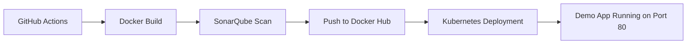

# CI/CD Pipeline Demo 🚀

> End-to-end CI/CD pipeline demo using **GitHub Actions**, **Docker**, **SonarQube**, and **Kubernetes**.  
> Automates build, code quality scan, containerization, and deployment workflow.

[](https://github.com/obintui10/ci-cd-pipeline-demo/actions)
[](https://www.docker.com/)
[](https://kubernetes.io/)
[](https://www.sonarqube.org/)

---
## 📂 Repository Structure
ci-cd-pipeline-demo/
├── .github/workflows/ci-cd.yml   # GitHub Actions pipeline
├── my-app/                       # Demo application (HTML/CSS/JS)
│   └── index.html
├── Dockerfile                    # Container build instructions
├── sonar-project.properties       # SonarQube configuration
└── README.md                     # Project documentation

## ⚡ Quickstart

```bash
# Clone the repo
git clone https://github.com/obintui10/ci-cd-pipeline-demo.git
cd ci-cd-pipeline-demo

# Build Docker image
docker build -t ci-cd-demo .

# Run locally
docker run -p 8080:80 ci-cd-demo

# Access app
http://localhost:8080

## 🏗 Architecture Diagram (Box Style)
```bash
+---------------------------+          +---------------------------+
|       GitHub Actions      |  ----->  |       Docker Build        |
|  CI/CD pipeline triggers  |          |  Build container image    |
+---------------------------+          +---------------------------+
                                              |
                                              v
                                    +---------------------------+
                                    |      SonarQube Scan       |
                                    |  Static code analysis     |
                                    |  Quality & security check |
                                    +---------------------------+
                                              |
                                              v
                                    +---------------------------+
                                    |     Push to Registry      |
                                    |  Publish Docker image     |
                                    |   (e.g., Docker Hub)      |
                                    +---------------------------+
                                              |
                                              v
                                    +---------------------------+
                                    |    Kubernetes Deploy      |
                                    |  Apply manifests to EKS   |
                                    |  or AKS cluster           |
                                    +---------------------------+
                                              |
                                              v
                                    +---------------------------+
                                    |   Demo App (Nginx)        |
                                    |  Runs on port 80          |
                                    |  Accessible via browser    |
                                    +---------------------------+

## 🔄 Workflow
- Code Commit → triggers GitHub Actions.
- Build & Test → Docker image created.
- Static Analysis → SonarQube scan runs.
- Push Image → Docker Hub registry updated.
- Deploy → Kubernetes manifests apply.
- Health Check → verifies app availability.
```
## 📊 Mermaid Diagram

## 🔮 Future Work
- Add Helm charts for Kubernetes packaging.
- Integrate ArgoCD for GitOps deployment.
- Expand demo app with CSS/JS for richer UI.
- Add monitoring via Prometheus + Grafana.
- Enable multi‑cloud deployments (AWS EKS + Azure AKS).


